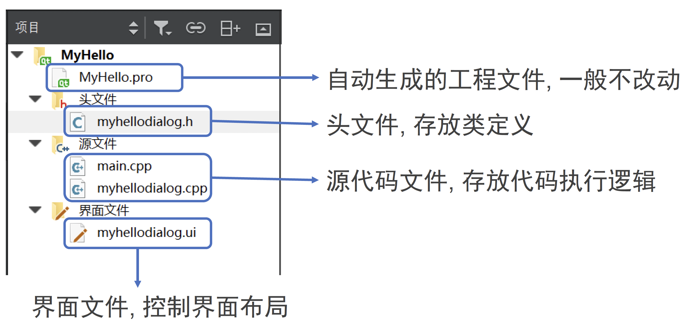
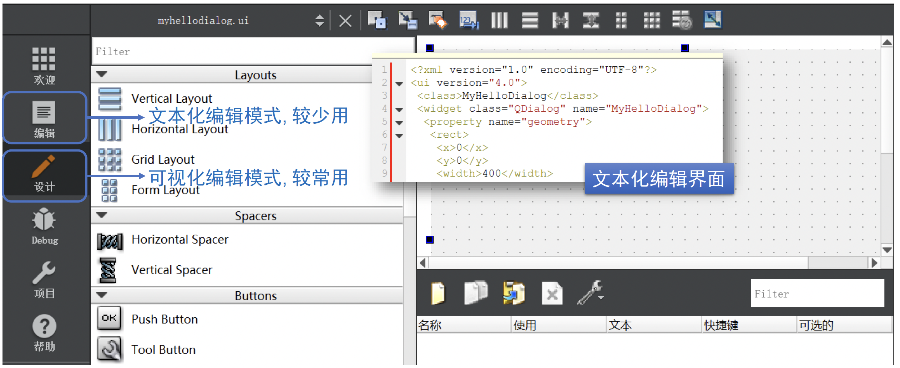

# QT入门文档

## 1. QT基本介绍

<!-- <div  align="center">    
 
</div> -->


### 1.1 背景信息
- 官网：https://www.qt.io/
- 下载：https://download.qt.io/
- 跨平台可视化开发工具(Winows/Mac/Linux/Android/IOS)

- 有收费版和免费的开源版(OpensourcedistributionunderanLGPLorGPLlicense)
- 免费版开发的桌面应用,发布时不要求开源,须带一些动态链接库,无法静态绑定到一个.exe文件
- Qt是核心库,类比Python
- QtCreator是IDE,用于开发桌面应用(如WPSoffice),类比Pycharm
- QtQuick可用于开发移动应用


### 1.2 用Qt创建桌面工程

1. 运行Qt Creator

2. 新建Qt Widgets项目（即带窗口界面的项目）

3. 指定文件夹和项目名称

4. 指定一个源文件中的类名以及其基类(QMainWindow或QDialog...)

5. 工程创建完成


### 1.3 Qt项目文件组成

- helloworld.pro 项目文件
- hellodialog.h用户自定义类的头文件
- hellodialog.cpp 用户自定义类的源文件
- main.cpp 程序的入口文件, 包括main函数
- hellodialog.ui程序的界面文件 (XML格式, 只能可视化编辑)

**hellodialog.h 用户自定义类的头文件**
```c++
#ifndef HELLODIALOG_H
#define HELLODIALOG_H
namespace Ui {// 界面的名字空间
    class HelloDialog;
}
class HelloDialog : public QDialog {
    Q_OBJECT; //宏定义
public:
    explicit HelloDialog(QWiget * parent = 0);
    ~HelloDialog();
private:
    Ui:: HelloDialog * ui;
};

#endif // HELLODIALOG_H
```

### 1.4 发布Qt编写的可执行程序

1. 在左下角选择release版并编译,在release版文件夹下面得到.exe文件
2. 将以下.dll文件和.exe文件放在同一文件夹下一起发布
    - libgcc_s_dw2-1.dll
    - libstdc++-6.dll
    - libwinpthread-1.dll (也可能不要)
    - Qt5Core.dll
    - Qt5Gui.dll
    - Qt5Widgets.dll

## 2. 示例0 创建Qt工程

演示如何创建一个简单的Qt工程
- 基类的选择与区别
- Qt工程的文件结构
- 各种文件的代码解读
- 窗口界面的设计与修改

### 2.1 创建工程类选择


### 2.2 不同“基类”的差别


- **基类**有QMainWindow, QDialog, QWidget可选
- QWidget是其他两个类的基类, 较为通用
- QMainWindow是有菜单栏的窗口
- QDialog显示一个临时的对话框

### 2.3 Qt工程文件结构



### 2.4 头文件myhellodialog.h解读


### 2.5 主函数main.cpp解读


### 2.6 类函数myhellodialog.cpp解读


### 2.7 窗口界面编辑




### 2.8 窗口添加新组件


### 2.9 修改组件内容(通过代码)


### 2.10 修改组件内容(通过属性栏)


