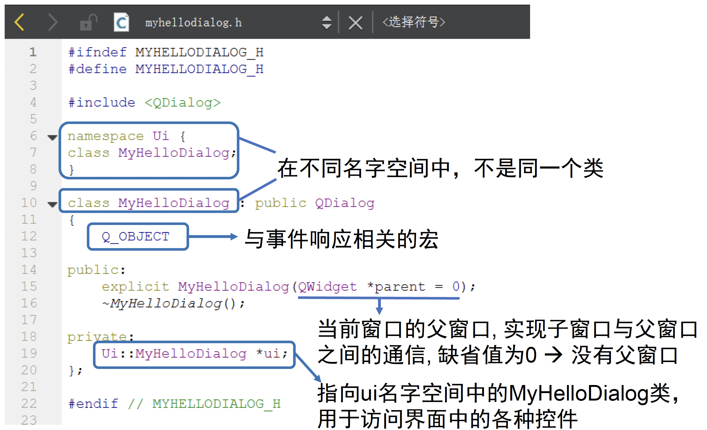
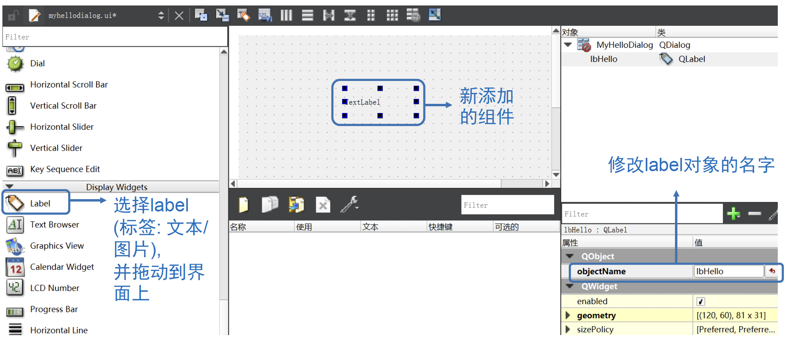

## QT基本介绍

<!-- <div  align="center">    
 
</div> -->


### 1.1 背景信息
- 官网：https://www.qt.io/
- 下载：https://download.qt.io/
- 跨平台可视化开发工具(Winows/Mac/Linux/Android/IOS)

- 有收费版和免费的开源版(Opensource distribution under an LGPL or GPL license)
- 免费版开发的桌面应用,发布时不要求开源,须带一些动态链接库,无法静态绑定到一个.exe文件
- Qt是核心库,类比Python
- QtCreator是IDE,用于开发桌面应用(如WPSoffice),类比Pycharm
- QtQuick可用于开发移动应用


### 1.2 用Qt创建桌面工程

1. 运行Qt Creator

2. 新建Qt Widgets项目（即带窗口界面的项目）

3. 指定文件夹和项目名称

4. 指定一个源文件中的类名以及其基类(QMainWindow或QDialog...)

5. 工程创建完成


### 1.3 Qt项目文件组成

- helloworld.pro 项目文件
- hellodialog.h用户自定义类的头文件
- hellodialog.cpp 用户自定义类的源文件
- main.cpp 程序的入口文件, 包括main函数
- hellodialog.ui程序的界面文件 (XML格式, 只能可视化编辑)

**hellodialog.h 用户自定义类的头文件**
```c++
#ifndef HELLODIALOG_H
#define HELLODIALOG_H
namespace Ui {// 界面的名字空间
    class HelloDialog;
}
class HelloDialog : public QDialog {
    Q_OBJECT; //宏定义
public:
    explicit HelloDialog(QWiget * parent = 0);
    ~HelloDialog();
private:
    Ui:: HelloDialog * ui;
};

#endif // HELLODIALOG_H
```

### 1.4 发布Qt编写的可执行程序

1. 在左下角选择release版并编译,在release版文件夹下面得到.exe文件
2. 将以下.dll文件和.exe文件放在同一文件夹下一起发布
    - libgcc_s_dw2-1.dll
    - libstdc++-6.dll
    - libwinpthread-1.dll (也可能不要)
    - Qt5Core.dll
    - Qt5Gui.dll
    - Qt5Widgets.dll

## 示例0 创建Qt工程

本示例演示如何创建一个简单的Qt工程
- 基类的选择与区别
- Qt工程的文件结构
- 各种文件的代码解读
- 窗口界面的设计与修改

### 2.1 创建工程类选择


### 2.2 不同“基类”的差别


- <font color=#4e70be>**基类**</font>有QMainWindow, QDialog, QWidget可选
- QWidget是其他两个类的基类, 较为通用
- QMainWindow是有菜单栏的窗口
- QDialog显示一个临时的对话框

### 2.3 Qt工程文件结构


- .pro文件：自动生成的工程文件
- .h文件：存放类定义的头文件
- .cpp文件：存放代码执行逻辑的源代码文件
- .ui文件：控制界面布局的界面文件


### 2.4 头文件myhellodialog.h解读




### 2.5 主函数main.cpp解读


### 2.6 类函数myhellodialog.cpp解读


### 2.7 窗口界面编辑


界面布局功能提供了两种窗口界面编辑模式：
- 文本化编辑模式
- 可视化编辑模式

#### 2.7.1 窗口添加新组件




#### 2.7.2 修改组件内容(通过代码)


#### 2.7.3 修改组件内容(通过属性栏)


**属性栏修改组件后myhellodialog.ui内容的变化**


## 示例1 创建窗口

本示例演示如何创建一个简单的Qt窗口

- 不用界面文件创建窗口
- 直接使用界面文件创建窗口

### 3.1 不用界面文件创建窗口

在这个例子中, 把窗口定义、显示的代码全部写到了 main.cpp中，即不使用界面文件创建窗口


**以上创建代码的创建结果**

- “Widget2”是一个独立窗口
- “label”是一个窗口
- “我是widget”是一个窗口, 其中label2是它的部件
- Dialog是一个对话框


### 3.2 直接使用界面文件创建窗口

更常用的创建窗口的方法是：定义一个自己的类，如MyWidget，然后在构造函数和类函数中去自定义该窗口的各种属性。

在以下的例子中，将演示如何定义一个Mydialog1类，创建使用界面，可以直接用界面文件 (可以更方便的设计ui)

#### 3.2.1 新建界面文件

##### 点击“新建文件或项目”


##### 选择“Qt 设计师界面类”


##### 根据需求选择界面模板


##### 为新定义窗口类取名


##### 使用默认设置完成创建


#### 3.2.2 进行ui设计

双击界面文件夹下的.ui文件可以设计ui


ui界面如下，可以鼠标选择一些控件然后设计窗口，设计完毕保存即可


#### 3.2.3 界面文件使用

在main函数里就可以直接使用定义好的MyDialog1类。


## 示例2 大小位置修改

本示例演示如何修改窗口大小、位置，并介绍qDebug

- 如何修改窗口大小、位置
- qDebug的介绍

### 4.1 如何修改窗口大小、位置


### 4.2 qDebug的使用

以下代码演示了如何使用qDebug

- 文件前 #include \<QDebug\>
- 利用qDebug在控制台console打印调试信息,  类似C语言的 printf和C++的cout的结合


注意: qDebug可输出的类型也有QString等QT中独有的类, 也可以通过重载运算符打印自己定义的class，常用来程序的调试

**要求的调试信息在控制台中打印效果如下**


## 示例3 模态与非模态对话框

本示例演示对话框的模态与非模态设置。

### 3.1 模态对话框

#### 3.1.1 定义

阻断了用户输入, 当一个模态对话框打开时, 用户只能与该对话框交互, 而其他界面对象收不到输入信息

#### 3.1.2 举例

关机时弹出的对话框, 会禁止用户对其他窗口进行操作, 必须取消这个对话框才能对其他对话框进行操作

### 3.2 非模态对话框

#### 3.2.1 定义

类似普通的windows窗口, 在非模态对话框打开时, 用户可同时打开其他窗口, 操作完毕后, 又可用鼠标或者其他方式激活该窗口

#### 3.2.2 举例

操作系统中不同窗口的切换

### 3.3 对话框的模态与非模态设置


**以上两行语句分别产生了两个窗口**


**注意：这里第一行语句之所以会产生窗口是因为MyWidget类的构造函数中定义了创建对话框**


#### 3.2.1 模态与非模态对话框的设置方法

通过setModal设置模态/非模态：

- (True) 模态对话框：弹出以后原窗口不能交互
- (False) 非模态对话框：弹出以后原窗口还能交互


**设置结果为：**


**注意：这里由于设置了dialog为模态对话框, 则关闭dialog之前不能与widget交互！！！**