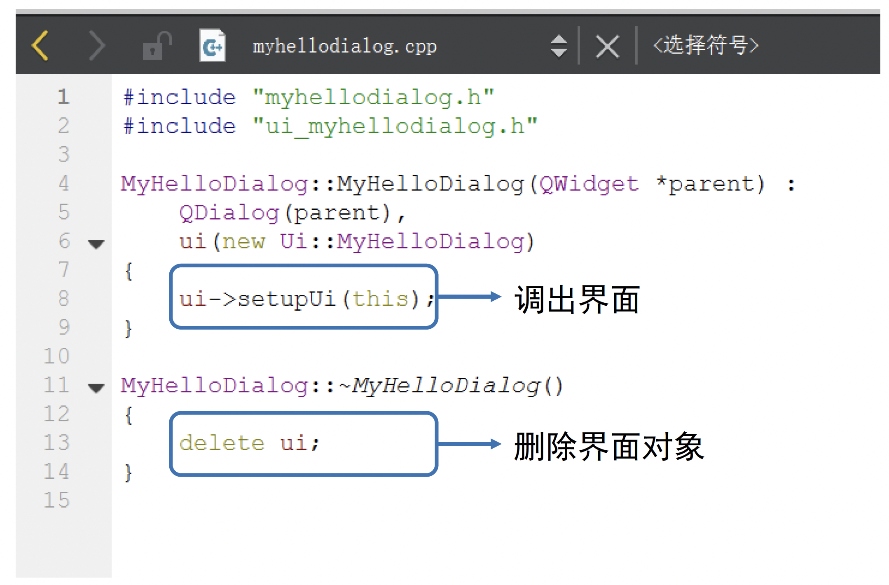
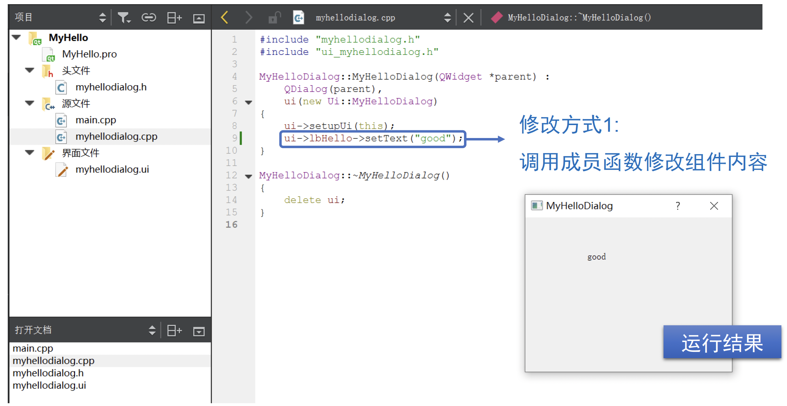

## QT基本介绍

<!-- <div  align="center">    
 
</div> -->


### 1.1 背景信息
- 官网：https://www.qt.io/
- 下载：https://download.qt.io/
- 跨平台可视化开发工具(Winows/Mac/Linux/Android/IOS)

- 有收费版和免费的开源版(Opensource distribution under an LGPL or GPL license)
- 免费版开发的桌面应用,发布时不要求开源,须带一些动态链接库,无法静态绑定到一个.exe文件
- Qt是核心库,类比Python
- QtCreator是IDE,用于开发桌面应用(如WPSoffice),类比Pycharm
- QtQuick可用于开发移动应用


### 1.2 用Qt创建桌面工程

1. 运行Qt Creator

2. 新建Qt Widgets项目（即带窗口界面的项目）

3. 指定文件夹和项目名称

4. 指定一个源文件中的类名以及其基类(QMainWindow或QDialog...)

5. 工程创建完成


### 1.3 Qt项目文件组成

- helloworld.pro 项目文件
- hellodialog.h用户自定义类的头文件
- hellodialog.cpp 用户自定义类的源文件
- main.cpp 程序的入口文件, 包括main函数
- hellodialog.ui程序的界面文件 (XML格式, 只能可视化编辑)

**hellodialog.h 用户自定义类的头文件**
```c++
#ifndef HELLODIALOG_H
#define HELLODIALOG_H
namespace Ui {// 界面的名字空间
    class HelloDialog;
}
class HelloDialog : public QDialog {
    Q_OBJECT; //宏定义
public:
    explicit HelloDialog(QWiget * parent = 0);
    ~HelloDialog();
private:
    Ui:: HelloDialog * ui;
};

#endif // HELLODIALOG_H
```

### 1.4 发布Qt编写的可执行程序

1. 在左下角选择release版并编译,在release版文件夹下面得到.exe文件
2. 将以下.dll文件和.exe文件放在同一文件夹下一起发布
    - libgcc_s_dw2-1.dll
    - libstdc++-6.dll
    - libwinpthread-1.dll (也可能不要)
    - Qt5Core.dll
    - Qt5Gui.dll
    - Qt5Widgets.dll

## 示例0 创建Qt工程

本示例演示如何创建一个简单的Qt工程
- 基类的选择与区别
- Qt工程的文件结构
- 各种文件的代码解读
- 窗口界面的设计与修改

### 2.1 创建工程类选择


### 2.2 不同“基类”的差别


- <font color=#4e70be>**基类**</font>有QMainWindow, QDialog, QWidget可选
- QWidget是其他两个类的基类, 较为通用
- QMainWindow是有菜单栏的窗口
- QDialog显示一个临时的对话框

### 2.3 Qt工程文件结构


- .pro文件：自动生成的工程文件
- .h文件：存放类定义的头文件
- .cpp文件：存放代码执行逻辑的源代码文件
- .ui文件：控制界面布局的界面文件


### 2.4 头文件myhellodialog.h解读


### 2.5 主函数main.cpp解读


### 2.6 类函数myhellodialog.cpp解读




### 2.7 窗口界面编辑


界面布局功能提供了两种窗口界面编辑模式：
- 文本化编辑模式
- 可视化编辑模式

#### 2.7.1 窗口添加新组件


#### 2.7.2 修改组件内容(通过代码)




#### 2.7.3 修改组件内容(通过属性栏)


**属性栏修改组件后myhellodialog.ui内容的变化**


## 示例1 创建窗口

本示例演示如何创建一个简单的Qt窗口

- 不用界面文件创建窗口
- 直接使用界面文件创建窗口

### 3.1 不用界面文件创建窗口

在这个例子中, 把窗口定义、显示的代码全部写到了 main.cpp中，即不使用界面文件创建窗口


**以上创建代码的创建结果**

- “Widget2”是一个独立窗口
- “label”是一个窗口
- “我是widget”是一个窗口, 其中label2是它的部件
- Dialog是一个对话框


### 3.2 直接使用界面文件创建窗口

更常用的创建窗口的方法是：定义一个自己的类，如MyWidget，然后在构造函数和类函数中去自定义该窗口的各种属性。

在以下的例子中，将演示如何定义一个Mydialog1类，创建使用界面，可以直接用界面文件 (可以更方便的设计ui)

#### 3.2.1 新建界面文件

##### 点击“新建文件或项目”


##### 选择“Qt 设计师界面类”


##### 根据需求选择界面模板


##### 为新定义窗口类取名


##### 使用默认设置完成创建


#### 3.2.2 进行ui设计

双击界面文件夹下的.ui文件可以设计ui


ui界面如下，可以鼠标选择一些控件然后设计窗口，设计完毕保存即可


#### 3.2.3 界面文件使用

在main函数里就可以直接使用定义好的MyDialog1类。


## 示例2 大小位置修改

本示例演示如何修改窗口大小、位置，并介绍qDebug

- 如何修改窗口大小、位置
- qDebug的介绍

### 4.1 如何修改窗口大小、位置


### 4.2 qDebug的使用

以下代码演示了如何使用qDebug

- 文件前 #include \<QDebug\>
- 利用qDebug在控制台console打印调试信息,  类似C语言的 printf和C++的cout的结合


注意: qDebug可输出的类型也有QString等QT中独有的类, 也可以通过重载运算符打印自己定义的class，常用来程序的调试

**要求的调试信息在控制台中打印效果如下**


## 示例3 模态与非模态对话框

本示例演示对话框的模态与非模态设置。

### 5.1 模态对话框

#### 5.1.1 定义

阻断了用户输入, 当一个模态对话框打开时, 用户只能与该对话框交互, 而其他界面对象收不到输入信息

#### 5.1.2 举例

关机时弹出的对话框, 会禁止用户对其他窗口进行操作, 必须取消这个对话框才能对其他对话框进行操作

### 5.2 非模态对话框

#### 5.2.1 定义

类似普通的windows窗口, 在非模态对话框打开时, 用户可同时打开其他窗口, 操作完毕后, 又可用鼠标或者其他方式激活该窗口

#### 5.2.2 举例

操作系统中不同窗口的切换

### 5.3 对话框的模态与非模态设置


**以上两行语句分别产生了两个窗口**


**注意：这里第一行语句之所以会产生窗口是因为MyWidget类的构造函数中定义了创建对话框**


#### 5.3.1 模态与非模态对话框的设置方法

通过setModal设置模态/非模态：

- (True) 模态对话框：弹出以后原窗口不能交互
- (False) 非模态对话框：弹出以后原窗口还能交互


**设置结果为：**


**注意：这里由于设置了dialog为模态对话框, 则关闭dialog之前不能与widget交互！！！**

## 示例4 信号和槽的自动关联

本示例将首先介绍Qt中信号槽机制，并展示如何通过设计界面，自动实现信号和槽的关联

### 6.1 Qt中的信号槽机制

#### 5.1.1 定义

在信号槽机制中, 某个事件发生会广播一个信号，如果一个对象对这个信号有兴趣就会使用连接 (connect) 函数，用自己的一个事件响应函数 (称为slot, 也就是槽) 来处理这个信号。

#### 5.1.2 举例

以按钮组件为例，在添加一个新的	“newButton” (名为btNewy) 的按钮组件后，通过信号槽机制, 可以实现点击这个按钮执行特定的函数的功能。


### 6.2 信号和槽的自动关联

信号槽机制的关键,	在于如何让程序知道对于某个信号, 应该调用什么槽函数进行处理, 即信号和槽的关联
**接下来的示例将展示如何通过设计界面,	自动实现信号和槽的关联**

#### 6.2.1 设置执行特定函数的信号

右键打开按钮组件的菜单栏，点击转到槽


之后会出现一个选择信号的界面，用来选择按钮在什么状态下会执行特定函数。


在达到这种状态时, 按钮组件就会在全局发送一个其他所有组件都能捕获的标识，这就是信号槽机制中的信号。

（这里选择了clicked()信号,表示按钮在被点击时就会向其他组件发送这个信号）

#### 6.2.2 创建槽函数

在选择好信号后，QtCreator会自动在 MyWidget类中生成一个私有的响应函数on_btNewy_clicked()，捕获到信号后这个函数就会被执行，这个响应函数就叫槽函数。


这里，QtCreator自动生成的槽函数的名字格式是on_xxx_yyy()，其中xxx为发出信号的组件名，yyy为信号名，这里程序判断信号和槽的是否关联的依据也是槽函数的名字

**注意自动生成的槽函数是私有成员函数,只能和类的成员组件发出的信号关联, 所以不会出现命名冲突的问题**

#### 6.2.3 设置槽函数内容

自动生成的槽函数是没有内容的, 可以给这个函数添加一个改变对话框的文本的行为来进行测试。


可以看到点击newButton后 MyWidget显示的文本按照槽函数的设置进行了改变


## 示例5 信号和槽的手动关联

上一个示例通过设计界面的“转到槽”功能,	自动进行了信号和槽函数的关联，本示例将展示如何手动进行信号和槽之间的关联。

### 7.1 connect函数

除了利用QtCreator 自动生成槽函数外，也可以在MyWidget类内部初始化时利用connect函数手动将某个组件的信号与自身成员函数或者其他类的公有成员函数进行关联。

- connect是QObject成员函数，各种类都继承于QObject，用于手动关联信号和槽。
- 指定ui➡showChildButton按钮上的clicked事件将由该对象的showChildDialog响应。


### 7.2 connect函数的参数

- 第一个参数：发出信号的组件

- 第二个参数：发出的信号，这里设置为点击“显示子窗口”按钮时发出的信号

- 第三个参数：捕获信号的对象，也就是执行槽函数的对象，this指代的MyWidget类

- 第四个参数：槽函数，这里的功能就是new一个新的Qdialog对话框并且显示出来

  

### 7.3 connect函数运行结果

点击按钮后执行槽函数弹出一个新的对话框


## 示例6 编辑槽映射

- 信号槽自动关联中，QtCreator会自动生成槽函数，但也需要自己写槽函数内容
- 信号槽手动关联中，利用connect函数允许随意设置信号和槽的关联，但需要在类的初始化阶段写相应代码，比较麻烦

接下来的示例将展示如何通过在UI设计界面编辑槽映射，实现一个组件的信号和另外组件的槽函数的关联。

### 8.1 示例效果

本示例的程序由下方的父窗口和上方的对话框组成

点击父窗口中的modify按钮将弹出对话框，接着点击对话框的OK按钮后，对话框与父窗口均会被关闭

本示例将借助编辑槽映射的方式来实现上述效果


### 8.2 实现过程

#### 8.2.1 添加按钮

在MyWidget主界面弹出的QDialog类型的对话框添加两个原始的 QPushButton类的按钮组件


#### 8.2.2 配置连接

1. 点击F4，选中发送信号的组件，拖动连线停在接收信号的组件，这里发送信号的按钮被命名为btOK，接收信号的对话框被命名为Dialog2


2. 松开鼠标后会出现配置连接的选项，可以在这里编辑槽映射


3. 这里选择发送方btOK的信号为clicked()，接收方Dialog2接收到信号后需要执行的槽函数为accept()：

- 行为逻辑变成了点击按钮,按钮会发出信号使对话框执行accept()函数
- accept() 函数会把对话框Dialog2的返回值设置为Accepted成员变量


4. 点击btModify按钮创建并弹出对话框Dialog2，点击Dialog2对话框的btOK按钮, 根据刚才编辑槽映射的结果, Dialog2会执行完毕并返回 Accepted变量


**在这里，过程都发生在btModify的槽函数中,这是MyWidget类的成员函数，所以当Dialog2对话框返回Accepted时,槽函数执行close()，主页面MyWidget也随之关闭。**

## 示例7 常用对话框介绍

本示例介绍以下八个常用的对话框：


### 9.1 颜色对话框

QColorDialog为Qt中的颜色对话框类设置Qt::red为默认选择的颜色


### 9.2 文件选择对话框

可以同时选择多个文件，并输出所有文件名


### 9.3 字体对话框

选择某种字体后，对应文字的字体会发生改变


### 9.4 输入对话框

- 对话框1：输入字符串对话框
- 对话框2：输入整数/浮点数对话框
- 对话框3：输入条目对话框


**输入对话框效果**


### 9.5 消息对话框


### 9.6 进度对话框


### 9.7 错误信息对话框


### 9.8 向导对话框


**向导对话框效果**


## 示例8 常用组件介绍

本实例将演示QToolBox, QListWidget, QStackedWidget三种常用组件。

### 10.1 QToolBox

#### 10.1.1 简介

1. QToolBox类提供了一个列（选项卡式的）部件条目
2. QToolBox可以在一个tab列上显示另外一个，并且当前的item显示在当前的tab下面。
3. 每个tab都在tab列中有一个索引位置
4. tab的item是一个QWidget

#### 10.1.2 使用QToolBox

- 在使用QToolBox时可以在设计中选择该组件，生成一个 QToolBox类的实例对象


QToolBox对象也可以在MyWidget中声明，具体细节可参考： https://blog.csdn.net/liang19890820/article/details/52439711


- 在设计QToolBox时，也可以在主界面 MyWidget的设计中声明一个新的QWidget的对象作为item，并用addItem函数插入 QToolBox对象中


- 设置结果如下图所示，可以看到比起之前多了一个显示"hello"的item


### 10.2 QListWidget

#### 10.2.1 简介

1. QListWidget类列表框控件用来加载并显示多个列表项
2. QListWidget对象中可以添加QListWidgetItem类型作为列表项， QListWidgetItem类的设置与之前的QToolBox类似

#### 10.2.2 使用QListWidget

- 在使用QListWidget时可以在设计中选择该组件，生成一个QListWidget类的实例对象


若想学习QListWidget和后面要学的QStackedWidget对象更多细节可参考：
https://blog.csdn.net/l09711/article/details/7315979

### 10.3 QStackedWidget

#### 10.3.1 简介

1. QStackedWidget可实现同一界面切换不同的窗口，直接切换就可以显示不同子窗口的内容
2. QStackedWidget类往往可以和QListWidget类共同完成界面的切换

#### 10.3.2 使用QStackedWidget

- 和之前类似，可以直接在 QtCreator的设计中插入 QStackedWidget对象


- QStackedWidget对象切换部件比较常用的一种方法是和QListWidget对象的列表项进行关联，通过QListWidget对象列表项的选择切换组件


这里利用了之前学的connect函数，在 QListWidget对象切换列表项的时候，发出信号并被QStackedWidget对象捕获，实行对应的槽函数（这里为显示对应的组件/页面）

## 示例9 常用按钮介绍

该示例将演示不同的按钮，按钮数组，按钮带menu等

### 11.1 QPushButton

QPushButton是最基本的按钮，一般在点击（click）时发出信号触发槽函数，建立槽映射的方法可参照示例5~7


### 11.2 QRadioButton

QRadioButton是单选按钮，除了点击后可发出信号触发槽函数外，也会记录是否选中了这个按钮


在点击QRadioButton对象后，触发了槽函数，打印了该按钮的名字并且还对主界面利用 setText函数进行文本的更新


注意：这里是一个 QRadioButton对象数组，数组在对象 QGroupBox中，所有 QRadioButton对象只能有一个被选中


### 11.3 QCheckBox

复选框和单选框用法类似，不过复选框 QCheckBox对象数组中的所有对象都是可以同时选中的


### 11.4 QMenu

这里为了给按钮提供菜单功能，先声明一个QMenu类的对象，这个类顾名思义是菜单类


act数组是之前声明好的QAction类，这里设置了放大和缩小两种行为。


设置好后便把act数组利用addAction函数添加到QMenu对象中，并利用connect把menu的action和槽函数 SLOT(menAction())关联


最后只需要把已经设置好的QMenu对象利用setMenu函数和按钮关联即可


## 示例10 常用输入框介绍

本示例将演示不同的输入框

### 12.1 QLineEdit

#### 12.1.1 简介

1. QLineEdit是一个单行文本输入框，带有撤销、剪切、粘贴以及拖拽等功能。
2. 通过改变输入框的echoMode()，同时也可以设置为一个“只写”字段，用于输入密码等。
3. 文本的长度可以被限制为maxLength()，可以使用一个 validator()或inputMask()来任意限制文本。

#### 12.1.2 使用QLineEdit


QLineEdit::setInputMask(const QString & inputMask)方法可以使Edit控件只允许输入自定义的格式字符串，inputMask参数设置格式化字符串的掩码。


比如这里ui设置了inputMask，第一位 A表示只接受输入ASCII character A-Z, a-z.

其他类似，详细内容请查看文档


通过validator函数也可以进行限制，这里限制对话框的输入只能为数字


QCompleter能实现自动填充功能,方便用户输入, 一般和QLineEdit搭配起来使用.


## 示例11 Spinbox和Datetime edit

本示例将演示Spinbox和Datetime edit的使用

### 13.1 QAbstractSpinBox

一句话概括：QAbstractSpinBox类提供了一个选择框和一个行编辑来显示值。


我们的程序产生的界面如下，均是QDataTimeEdit类的实例对象，用于编辑日期和时间


拓展：此外还可以设置日期、时间显示格式、选择弹出日历、设置日期时间改变时的槽函数等等。这些均与之前讲过的设置类似，详细可参考：

- https://doc.qt.io/qt-5/qdatetimeedit.html
- https://blog.csdn.net/liang19890820/article/details/52387275

### 13.2 SpinBox

#### 13.2.1 简介

- QSpinBox旨在处理整数和离散值集（例如月份名称）；使用QDoubleSpinBox来处理浮点值。
- QSpinBox允许用户通过单击上/下按钮或按键盘上的上/下按钮来选择一个值，以增加/减少当前显示的值。


每次值更改时，QSpinBox都会发出两个 valueChanged()信号，一个信号提供整数，另一个信号提供QString。QString带有数值及其前后缀（在这里前缀就是“$”,后缀就是“%”）。


拓展：QT提供了多个函数接口可以实现设置步长、字符串到数值的转换、开启循环、默认值等等功能。详细请参考：

- https://doc.qt.io/qt-5/qspinbox.html
- https://blog.csdn.net/YinShiJiaW/article/details/104896416

## 示例12 Slider和Dial

本示例演示了Slider和Dial的使用

### 12.1 Qslider

QSlider部件提供了一个垂直或水平滑动条。滑块是一个用于控制有界值的典型部件。它允许用户沿水平或垂直方向移动滑块，并将滑块所在的位置转换成一个合法范围内的值。

常用的函数是setValue()，用来设置滑块的当前值。Value改变时会发出valueChanged信号

当tracking参数（一个可选参数）设置为True时，改变value会随之改变Slider的position（就是那个可拖动的块）


QSlider类是QAbstractSlider类的子类，QSlider类又增加了刻度可选功能TickPosition


### 12.2 QDial

#### 12.2.1 简介

和QSlider类似，Qdial也是QAbstractSlider的子类。QDial类提供了四舍五入的范围控制（如速度及或者电位计），有一定刻度的圆形控件

关于信号：

- 移动滑块时，sliderMoved信号发出
- 没有禁用跟踪tracking属性时，valueChanged信号一起发出
- 按下/释放鼠标按钮时，转盘发出SliderPressed和 SliderReleased信号

#### 12.2.2 使用QDial

这里我们设置了槽映射：（具体方法可以看示例6）

当dial被鼠标移动时，发出sliderMoved信号，然后对应的三个接收者都会调用setValue槽函数，效果就是部件同步移动


拓展：更多内容可参考： 

- https://doc.qt.io/qt-5/qdial.html 
- https://doc.qt.io/qt-5/qslider.html